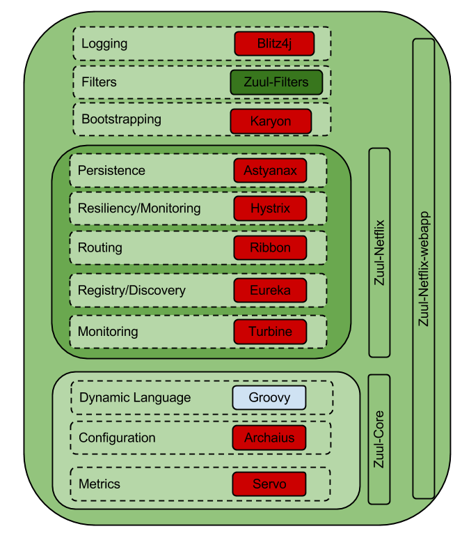

# zuul

### Resources

https://netflixtechblog.com/announcing-zuul-edge-service-in-the-cloud-ab3af5be08ee

Zuul is an L7 application gateway that provides capabilities for dynamic routing, monitoring, resiliency, security, and more

At the center of Zuul is a series of filters that are capable of performing a range of actions during the routing of HTTP requests and responses. Filters do not communicate with each other directly — instead they share state through a RequestContext which is unique to each request.

There are several standard filter types that correspond to the typical lifecycle of a request:
PRE filters execute before routing to the origin. Examples include request authentication, choosing origin servers, and logging debug info.
ROUTING filters handle routing the request to an origin. This is where the origin HTTP request is built and sent using Apache HttpClient or Netflix Ribbon.
POST filters execute after the request has been routed to the origin. Examples include adding standard HTTP headers to the response, gathering statistics and metrics, and streaming the response from the origin to the client.

Zuul can add, change, and compile filters at run-time, system behavior can be quickly altered. We add new routes, assign authorization access rules, and categorize routes all by adding or modifying filters. And when unexpected conditions arise, Zuul has the ability to quickly intercept requests so we can explore, workaround, or fix the problem.

A filter can be written to route a specific customer or device to a separate API cluster for debugging. Zuul has what we call a “SurgicalDebugFilter”. This is a special “pre” filter that will route a request to an isolated cluster if the patternMatches() criteria is true.

